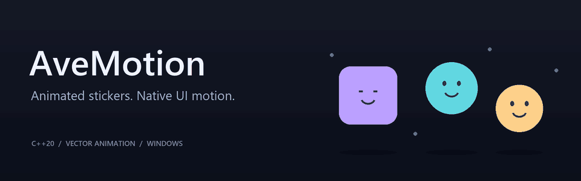

# AveMotion



**Animated stickers and vector motion for native applications.**

`C++20` · `Windows` · `Direct2D` · `JSON / TGS` · `Experimental`

AveMotion is an embeddable vector-animation engine being developed for animated
stickers and interface motion. Its own preparation, evaluation, geometry and
playback components are progressively replacing the reference runtime, with
integration tested in [Avelabs UI](https://github.com/avebeetle/Avelabs-UI).
The engine can be linked statically into the application's EXE; a separate DLL
is not required.

The animated header is original project artwork, not a playback capture.

## Animated stickers and UI motion

- 🎞️ **Vector playback** — admitted Lottie JSON and compressed Telegram `.tgs`
  inputs, with explicit rejection of unsupported content.
- 🎛️ **Playback controls** — play, pause, stop and seek through the centralized
  Player, with host-controlled visibility and lifetime.
- 🪟 **Native integration** — backend-neutral core, a Windows Direct2D backend
  and an experimental Qt Widgets host in Avelabs UI.
- 🔬 **Measured development** — differential tests, deterministic fixtures,
  capture checks and a private corpus laboratory guide capability expansion.

## Current engine status

**Own path.** Owned preparation, evaluation and scene generation support bounded
primitive, Duck and Duck X3 profiles without linking rlottie in the checked host
build. Unsupported semantics fail explicitly rather than silently switching to
the reference engine. Full Lottie coverage and general SVG import are not provided.

**Reference path.** A pinned Telegram `rlottie` snapshot remains available for
parsing, comparison and characterization. Samsung `rlottie` is retained as an
optional comparison baseline, not the normal product dependency.

**Rendering.** The current own Avelabs route uses software Direct2D WARP and pixel
readback for Qt presentation. Hardware GPU acceleration, production readiness
and Release performance improvements are not claimed.

The separately installable no-reference package exports product APIs, but its
public Runtime loader cannot load/play Lottie JSON or TGS without a reference
engine. It is not interchangeable with the bounded own host path.
See [module builds and package boundaries](docs/MODULE_BUILD.md).

## Documentation

| Topic | Start here |
| --- | --- |
| Source layout and naming | [Repository layout](docs/REPOSITORY_LAYOUT.md) |
| Integration and static libraries | [Module builds and offline package](docs/MODULE_BUILD.md) |
| Playback and scheduling | [Player scheduler](docs/PLAYER_SCHEDULER.md) |
| Windows rendering | [Direct2D backend](docs/DIRECT2D_BACKEND.md) |
| JSON and compressed input | [TGS loading](docs/TGS_LOADING.md) |
| Supported features and validation | [Asset validation](docs/ASSET_VALIDATION.md) |
| Real input coverage and current limitations | [Real corpus](docs/REAL_CORPUS_2026-10-08.md) |
| Own Duck X3 evidence | [Engine report](docs/PART26O_DUCK_X3_ENGINE_REPORT.md) |

## Build and test

Build profiles and their boundaries are documented in the
[module guide](docs/MODULE_BUILD.md). Windows development requires the existing
MSVC developer environment; Direct2D is Windows-only.

The Telegram reference laboratory also has Linux profiles:

```bash
cmake --preset linux-clang-telegram-debug
cmake --build --preset linux-clang-telegram-debug --parallel 4
ctest --preset linux-clang-telegram-debug --output-on-failure
```

These reference checks are not proof of the installed Windows UI or hardware GPU
behavior. Current task checkpoints and acceptance limits are in
[development state](docs/superpowers/STATE.md).

## Private corpus laboratory

Analyze an existing local collection without publishing its artwork:

```bash
python scripts/run_part24_corpus_lab.py \
  --input-dir C:/stickers \
  --output C:/reports/avemotion-corpus
```

ZIP input supports bounded temporary extraction with `--input-zip` instead of
`--input-dir`. Default reports use content-derived aliases and do not copy source
assets or expose their paths. The committed deterministic corpus is a smoke test,
not a representative downloaded sticker collection.
See [corpus laboratory](docs/CORPUS_LAB.md).

## Licensing and artwork

AveMotion-owned code does not yet have a selected final public license. Telegram
and derivative portions retain their applicable LGPL obligations; third-party
notices remain in the repository. A file-level licensing review is required
before public SDK distribution. See [NOTICE](NOTICE.md) and
[license and security notes](docs/LICENSE_AND_SECURITY.md).

External sticker artwork is evaluated locally where provenance is recorded;
SDK source licensing is not permission to redistribute that artwork. The header
uses original geometric illustrations, not Telegram sticker assets.

## Development principle

**Characterize → isolate → implement → compare → preserve the oracle.**

Expand common engine capabilities from verified inputs, preserve explicit
unsupported results, then optimize the measured bottlenecks in the real host.
